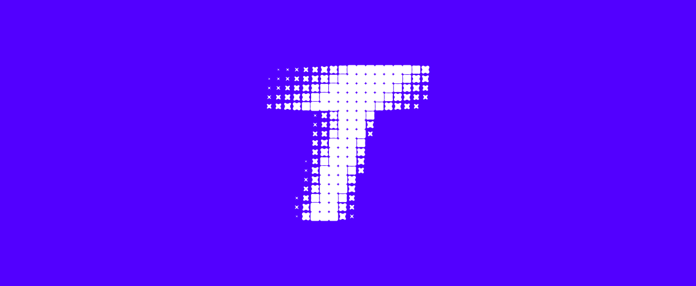

# Turbo Genesis SDK

[](https://docs.rs/turbo-genesis-sdk)
[](https://crates.io/crates/turbo-genesis-sdk)
[](LICENSE)



A flexible Rust SDK for building WebAssembly–powered games on the [Turbo](https://docs.turbo.computer), with first-class support for graphics, audio, input, and netcode.

## 🌟 Features

- **Canvas**: 2D drawing primitives text, sprites (static and animated), etc + camera movement and zoom.
- **Audio**: Load/play/loop audio assets.
- **Input**: Handle keyboard, mouse, touch, and gamepad input.
- **System**: Console logging, get monotonic and system time, save data to local storage.
- **Utility**: Built-in libraries for easing transitions (tweening) and creating advanced GUI layouts.
<!-- - **HTTP** (`http`): fetch, post, JSON convenience -->

## 🚀 Getting Started

1. Install Turbo

   You can find full install instructions on the [Turbo Docs](https://docs.turbo.computer/learn/installation)

1. **Create your project**

   ```bash
   turbo init my-turbo-app
   ```

   This will automatically add the SDK as a dependency in your project's `Cargo.toml`:

   ```toml
   [dependencies]
   turbo = { package = "turbo-genesis-sdk", version = "..." }
   ```

   The SDK version will vary based on the version of `turbo` installed. It is best to ensure your on the latest version of `turbo` and the SDK when starting a new project.

1. **Write your code**

   Open `src/lib.rs` and drop in:

   ```rs
    use turbo::*;

   #[game]
   #[derive(BorshDeserialize, BorshSerialize)]
   struct MyGame {
      greeting: String,
   };
   impl MyGame {
      pub fn new() -> Self {
         Self {
            greeting: "Hello, Turbo!".to_string(),
         }
      }
      pub fn update(&mut self) -> Self {
        // Clear the background with a hex color:
        clear(0xff00ffff);
        // Draw text to the screen:
        text!(&self.greeting);
        // Draw a rotated square:
        rect!(w = 50, h = 50, color = 0xffffffff, rotation_deg = 45);
      }
   }
   ```

1. **Run with Turbo**

   ```sh
   turbo run -w .
   ```

## 📖 Documentation

- Full API docs on [docs.rs/turbo-genesis-sdk](https://docs.rs/turbo-genesis-sdk)
- Turbo docs on [docs.turbo.computer](https://docs.turbo.computer/learn/installation)

## 📜 License

This project is licensed under MIT. See [LICENSE](LICENSE.md) for details.
